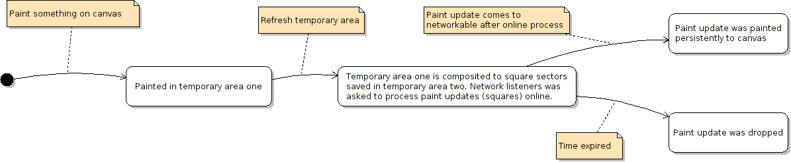

Overview
========

This is only overview particular documentation is in JavaDoc.

Collab canvas framework is designed for offline and online use cases. So canvas can be started in two modes, offline and online. The only difference between online and offline mode is style of painting. All API excluding some paint methods behaves same in both modes. 

Offline mode
-----------

This mode is simple, if you paint something to canvas it's just painted.

Online mode
-----------

Online mode is little bit more complicated than offline mode. Difference is, that if you paint something to canvas, it's not painted directly to layer but first to temporary area.

Every layer has own temporary area and everithing you painted to canvas is painted there. After some interval Canvas checks temporary area for changes. If some changes are there canvas split this changes to square sectors, save sectors, clear temporary area and call some (yours) interface with all new sectors. After this operation you can procces updates/sectors (for example: send it to server and wait to receive it again) and after process you call canvas that updates are processed. Whne canvas get information that some sector is processed, it removes this sector and paint it permanently to layer.

When canvas is painted, it split temporary area with saved sectors and layer persistent image.

Why temporary area and sectors exists in online mode can be explained on this example:
--------------------------------------------------------------------------------------

You use Collab canvas in program for real-time collaborative painter, so you want everybody can see what other users painting. If user paint something directly to canvas (not to temporary area) and send this update via internet to other users and in the same time some other user paint in the same point something other perhaps problem with order of paint occurs. First user has own painting under painting of second user and second user has own painting under painting of first user. So it's problem. Another solution of this problem is simply all painting send first to server and wait with painting to canvas to receive of paint updates, but on internet can be delay too big. It's the reason why temporary area exists, users paint everithing imediately (and it can be painted in wrong order -- it's not so probable but possible) and after this changes is proccessed on server and received back canvas repaint it persistently in right order (every connected user gets updates from server in same order), so everybody see the same image!

How to work with canvas
-----------------------

Canvas can be created by CollabCanvasFactory and its instance has few public methods. There is method to destroy canvas (if you need canvas no more), method to get canvas SWING component (JComponent) and methods to get API interfaces.

All you do with canvas should be do by us APIs. Below is list of APIs and short descriptions. More particular documentation is in JavaDoc.

* Informing - API for attaching listeners of actions on canvas (like mouse position)
* Listenable - API for attaching listeners of user actions over canvas (like mouse motion, keyboard evetns, ...)
* Networkable - API for attaching listeners for sectors changes, informing that sector was processed, etc.
* Paintable - API for manipulation with layers, painting, etc.
* Selectionable - API for work with selection
* Visible - API for work with mouse cursor, previews, etc.
* Zoomable - API for work with canvas zoom

Examples
--------

Examples of simple usage of canvas are in package cz.mgn.collabcanvas.examples (directory %repository%/src/cz/mgn/collabcanvas/examples/).
